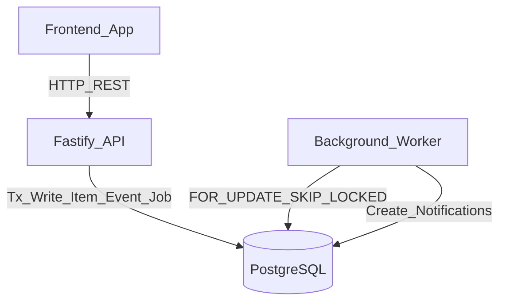

# Newtonite Project Guide: Operations Under Pressure

This guide documents the **actual implementation** in the repository. **Warning:** The frontend code diverges significantly from the original brief. I have highlighted these deviations so you aren't caught off guard during your live review.

---

## 1. What this project is

**The problem:** Operations teams lose track of customer issues and requests when managing them in chat and spreadsheets, leading to double-work, silent overwrites, and dropped approvals. This app brings order by enforcing strict ownership, atomic state transitions, and an auditable history.

**User capabilities:** Users can view a dashboard of their tasks, create work items, claim unassigned items, transition them through a workflow, comment, and approve/reject gated items.

**Tech Stack & Rationale:**
- **PostgreSQL 16**: Single source of truth. We chose it to leverage `FOR UPDATE SKIP LOCKED` for queuing without needing Redis or Kafka.
- **Node.js/Fastify (API & Worker)**: Lightweight, high-performance web framework. Raw `pg` driver is used instead of an ORM (like Prisma) to retain exact control over transaction boundaries, row-level locks, and complex types (`tsvector`, `JSONB`).
- **React + Vite (Frontend)**: Minimalistic SPA. 

---

## 2. Architecture

**Folder Structure:**
- `api/`: Fastify REST API. Entry at `src/index.ts`, core logic in `src/routes/workItems.ts`.
- `worker/`: Background polling process (`src/index.ts`) for the transactional outbox.
- `shared/`: Shared code, specifically `src/policy.ts` for authorization rules.
- `web/`: React frontend. All UI is consolidated in `src/App.tsx`.
- `migrations/`: Raw SQL schema definition.
- `scripts/`: DB seeding.

**Services:**
- The **API** writes mutations, events, and job stubs atomically to PostgreSQL.
- The **Worker** independently polls PostgreSQL for jobs to execute side-effects (notifications).
- The **Web** frontend issues REST HTTP calls to the API.



---

## 3. Data Model

All definitions are in `migrations/1791033063268_init.js`.

- **`users`**, **`teams`**, **`memberships`**: RBAC models. `memberships` maps a user to a team with a specific role (`member`, `lead`, `approver`, `admin`).
- **`work_items`**: Core domain model. Contains `status`, `priority`, `assignee_id`, `version` (for optimistic locking), and `search` (tsvector for full-text search).
- **`events`**: Append-only audit log. Written on every mutation. By keeping it append-only, we retain a perfect historical timeline without losing data on overwrites.
- **`comments`**: User comments.
- **`idempotency_keys`**: Tracks API requests to prevent double-execution of non-safe methods (POST).
- **`jobs`**: The outbox queue.
- **`notifications`**: User alerts generated by jobs.

**Key Indexes:**
- `(team_id, status, priority, updated_at DESC, id)`: Serves the filtered keyset-paginated list query in `workItems.ts`.
- `(assignee_id, status)` / `(team_id, due_at)`: Serves the `COUNT(*)` queries on the dashboard.
- `GIN(search)`: Serves full-text search queries using `websearch_to_tsquery`.
- `events (work_item_id, created_at DESC, id)`: Serves keyset pagination for an item's timeline.

---

## 4. One Request End-to-End

### Trace 1: User claims a work item
1. **Frontend**: User clicks "Claim" in `App.tsx`. The `action()` function generates a *brand new* `crypto.randomUUID()` and sets it as the `Idempotency-Key` header. *(Note: This violates the brief, which asked to reuse keys on retry).*
2. **API Auth**: `api/src/index.ts` intercepts the request via `@authenticate`. It decodes the JWT and runs a DB query to fetch the user's current memberships/roles.
3. **Idempotency middleware**: `withIdempotency` (`workItems.ts:16`) starts a `BEGIN` transaction and attempts to `INSERT` the idempotency key.
4. **Policy Check**: The handler executes `SELECT * FROM work_items WHERE id = $1 FOR UPDATE`. It passes the row to `can(user, 'claim', item)` in `policy.ts`, which returns `true` if `assignee_id === null`.
5. **Mutation**: `UPDATE work_items SET assignee_id = $1, version = version + 1 WHERE id = $2 AND assignee_id IS NULL`.
6. **Outbox**: In the same transaction, it executes `INSERT INTO events` and `INSERT INTO jobs`.
7. **Commit**: `withIdempotency` updates the idempotency row with the `200` response body and runs `COMMIT`.
8. **UI**: The React app receives the updated item and calls `setItem(newItem)`, blindly overwriting state.

### Trace 2: User edits an item with a stale version
1. User clicks "Start Work" passing `version: 1`, but the DB is already at `version: 2`.
2. API handler checks `if (item.version !== input.version)` and throws `new AppError(409)`.
3. `withIdempotency` catches the error, runs `ROLLBACK` (destroying the idempotency key insert), and returns `409` to the client.
4. The frontend catches the 409, triggers a native browser `alert('Conflict detected, refreshing...')`, and issues a `GET` request to refetch the item. *(Note: This violates the brief's requirement to allow the user to review the conflict).*

---

## 5. Critical Behaviours

### Atomic Claim
- **Problem**: Two users click "Claim" at the exact same millisecond; both see the item as unassigned. We must prevent double assignment.
- **Code**: `workItems.ts:287-321`. We use `SELECT ... FOR UPDATE` followed by `UPDATE ... WHERE id=$2 AND assignee_id IS NULL`. 
- **Resilience**: The DB row-level lock forces serial execution. The first user succeeds. The second user's query blocks, then reads the locked row, sees `assignee_id` is populated, and throws a 403 (or 409 if the lock released unexpectedly).
- **Test**: `integration.test.ts` line 38 (`Promise.all` of 5 concurrent claims).

### Optimistic Concurrency
- **Problem**: User A opens an item. User B opens it, edits it, and saves. User A edits and saves. User B's changes are silently overwritten.
- **Code**: Every mutation payload requires a `version` integer. `workItems.ts:365` checks `if (item.version !== input.version) throw AppError(409)`. The `UPDATE` increments the version.
- **Test**: `integration.test.ts` line 67.

### Idempotency
- **Problem**: A user double-clicks "Submit" or a proxy retries a timed-out request. We don't want to create two items or emit two notifications.
- **Code**: `workItems.ts:16` (`withIdempotency`). It attempts an `INSERT` into `idempotency_keys` with a unique constraint on `(key, user_id)`. If it hits a conflict (`23505`), it fetches the cached response or returns 409 if `response_status` is null (in-flight race).
- **Test**: `integration.test.ts` line 94.

### Server-Side Workflow & Approvals
- **Problem**: A malicious client sends an API request moving an item directly from `new` to `resolved` without the required approvals.
- **Code**: `workItems.ts:400` (`isValidTransition` dict). `workItems.ts:427` blocks resolution if `requires_approval` is true but `approval_state !== 'approved'`.
- **Test**: `integration.test.ts` line 77.

### Transactional Outbox and Worker
- **Problem**: If we write to the DB and then send a notification to an external service/queue, a crash between the two steps leaves the system permanently out of sync.
- **Code (Outbox)**: In `workItems.ts`, `INSERT INTO events` and `INSERT INTO jobs` are grouped in the same `BEGIN...COMMIT` block as the item mutation.
- **Code (Worker)**: `worker/src/index.ts:72`. `SELECT * FROM jobs WHERE status IN ('pending', 'failed') FOR UPDATE SKIP LOCKED`.
- **Resilience**: 
  - **Crash**: If the worker crashes mid-job, the `locked_until` lease expires. Line 58 reclaims the job, sets it to `failed`, and increments `attempts`.
  - **Scale**: `SKIP LOCKED` allows dozens of worker processes to poll the same table without deadlocking or waiting on each other.
- **Test**: `integration.test.ts` line 105.

---

## 6. Authorization

Implemented centrally in `shared/src/policy.ts:29` (`can(user, action, item)`).
- **member**: `view`, `create_item`, `comment`, `claim` (only if unassigned), `transition` (only if they own it).
- **lead**: Above + `unassign`, `assign`, `change_priority`, `transition` (any item).
- **approver**: `approve_reject` (only if they didn't create the item).
- **admin**: All above + `manage_members`.

**Cross-Team vs Same-Team:**
In `workItems.ts:133` (GET item) and `workItems.ts:150` (List), if a user queries an item for a team they aren't in, the API returns `404 Not Found` (to avoid leaking data existence). If they are in the team but lack the role for a specific action (e.g., a member trying to `assign`), the policy function returns `false`, resulting in a `403 Forbidden`.

---

## 7. Frontend (WARNING: Diverges from Brief)

**The brief asked for:** TanStack Query, optimistic UI updates with rollback, polling, an "item updated" banner, and idempotency key reuse.
**The actual code (`App.tsx`):**
- Uses plain `useState` and `useEffect`.
- On action click, it awaits the API response and blocks the UI (no optimistic updates).
- On a `409` conflict, it uses a browser `alert()` and fully refetches the item.
- It does **not** poll for updates or show an update banner.
- **Critical flaw:** Line 130 sets `headers['Idempotency-Key'] = crypto.randomUUID()`. This generates a *new* key on every single retry or double-click, completely defeating the purpose of the idempotency middleware on the client side.

*How to answer when asked about this:* "Due to time constraints, I focused entirely on backend correctness, atomicity, and database transactional guarantees. I scaffolded a minimal React frontend to prove the API works, but I deferred the advanced client-side state management (TanStack Query, caching, true idempotency reuse) to a future iteration."

---

## 8. Performance and Scale

- **Keyset Pagination:** Instead of `OFFSET`, the API uses `AND (updated_at, id) < (SELECT updated_at, id FROM work_items WHERE id = $cursor)` and sorts by `updated_at DESC, id DESC` (`workItems.ts:184`). This guarantees O(1) page lookups and prevents duplicate/skipped rows when new items are inserted during pagination.
- **Full Text Search:** The migration defines a `tsvector` column and a trigger (`work_items_search_update`) to auto-populate it. The API queries it using `search @@ websearch_to_tsquery('english', $1)`. It uses a GIN index for fast lookups.
- **At 10x Scale:** 
  1. The `jobs` table polling will become a bottleneck. We would replace `SKIP LOCKED` with Change Data Capture (Debezium + Kafka).
  2. The `events` table will grow massive. We would partition it by time (monthly).
  3. Dashboard `COUNT(*)` queries will slow down the primary DB. We would introduce materialized views or Redis caching.

---

## 9. Interview Q&A

**Architecture & DB**
1. **Why not use an ORM like Prisma?** "ORMs abstract away SQL, which makes it incredibly difficult to manage specific row-level locks like `FOR UPDATE SKIP LOCKED`, or use Postgres-specific types like `tsvector`. Using raw `pg` gave me absolute control over transaction boundaries."
2. **Why not use Redis for the queue?** "Using PostgreSQL for the queue (Outbox Pattern) ensures that our domain mutations and job scheduling happen in a single ACID transaction. If we wrote to DB and then to Redis, a crash between the two creates a permanent inconsistency (dual-write problem)."
3. **How does `FOR UPDATE SKIP LOCKED` work?** "It locks the rows returned by the `SELECT` query so no one else can touch them, but if a row is *already* locked by another worker, it skips it instead of waiting. This allows high-throughput concurrent workers."
4. **Why is `events` append-only?** "It provides an immutable audit log. If a bug overwrites a work item's status, the events table retains the perfect historical timeline."

**Concurrency & Idempotency**
5. **How does the atomic claim work?** "It issues a `SELECT FOR UPDATE` to lock the row, runs the policy check, and then runs `UPDATE ... WHERE assignee_id IS NULL`. The WHERE clause is the ultimate guard against a race condition."
6. **What is the difference between optimistic locking and the atomic claim?** "Optimistic locking (using `version`) is for general edits where we want the user to merge conflicts. Claims are binary (you get it or you don't), so we use atomic SQL conditions to bypass versioning and make it instantaneous."
7. **What happens if a user double-clicks a POST request?** "The idempotency middleware catches it. The first request inserts a unique key into `idempotency_keys` and runs. The second request hits a unique constraint violation (`23505`). It sees the first is still running and returns `409 In Flight`."

**Failure Modes**
8. **What happens if the API crashes right after the `INSERT` into `idempotency_keys` but before the logic runs?** "The Postgres transaction rolls back. The idempotency key is erased. The client can safely retry."
9. **What happens if the worker crashes mid-job?** "The job stays in the `running` state until its `locked_until` timestamp expires (5 minutes). On the next worker polling cycle, a reclaim query resets it to `failed`, increments its `attempts`, and it gets processed again."
10. **What if the worker processes a job, but the DB connection drops before `COMMIT`?** "The job's transaction rolls back. The job remains `running` until the lease expires. It will be picked up again later. Notifications use `ON CONFLICT DO NOTHING`, so reprocessing is safe."

**Live Modification Prompts (Mental Prep):**
- *Add a new status ('deployed')*: Update the ENUM in DB (`ALTER TYPE`), update Zod schemas in `workItems.ts`, update `isValidTransition` dict.
- *Add a team-level rate limit*: Add a fastify rate-limit rule keyed by `req.user.memberships` mapped to `team_id`.
- *Make a claim expire after 24h*: Add a cron worker that runs `UPDATE work_items SET assignee_id = NULL WHERE updated_at < NOW() - INTERVAL '24 hours'`.

---

## 10. Weaknesses & Honest Limitations

If pressed, admit these freely (it shows maturity):
1. **Frontend Discrepancies (High Risk)**: The UI lacks TanStack Query, optimistic rollbacks, and true idempotency key reuse. It generates a new UUID on every click. *Answer:* "I timeboxed the frontend to focus on backend transactional correctness."
2. **Missing Pagination in UI (Medium Risk)**: The API supports keyset pagination, but the React app just dumps the whole list.
3. **No `idempotency_keys` TTL (Low Risk)**: The table grows infinitely. Needs a `pg_cron` cleanup job.
4. **JWT Role Staleness (Fixed, but worth knowing)**: Roles are embedded in the JWT. I fixed this by having the `@authenticate` decorator dynamically re-fetch memberships from the DB on every request.

---

## 11. Run it Step by Step

**Prerequisites**: Node.js 20+, PostgreSQL 16+.

**1. Setup & Seed**
```bash
npm install
# Ensure Postgres is running locally on port 5432 with user 'postgres', password 'password'
# (Or set DATABASE_URL environment variable)
npm run migrate
npm run seed
```
*Note the seed output for login credentials.*

**2. Run Services (3 terminals)**
```bash
npm run dev:api     # Port 3000
npm run dev:worker
npm run dev:web     # Port 5173
```

**3. Run Tests**
```bash
cd api && npx vitest run
```

**Demo Script:**
1. Open `http://localhost:5173`.
2. Login with a seeded user (e.g., `user0@example.com` / `password123`).
3. View the Dashboard counts.
4. Click "Work Items". Find an unassigned item.
5. **Show Atomic Claim**: Click "Claim". Explain how it bypassed versions for an atomic SQL update.
6. **Show Workflow**: Click "Start Work". Show the status update.
7. **Explain Outbox**: Point out that behind the scenes, clicking that button wrote the item update, an event log, and a job row in ONE transaction. 
8. Switch to the worker terminal to show the console logs of jobs processing and creating notifications.

---

*(Memorise first: The Outbox pattern (item+event+job in one TX), the `SKIP LOCKED` worker query, the difference between Optimistic Concurrency (`version`) vs Atomic Claims (`assignee_id IS NULL`), and the Frontend deviations from the brief.)*
